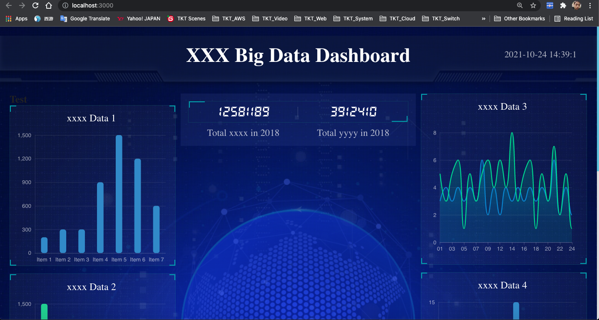

# Introduction

This project was bootstrapped with [Create React App](https://github.com/facebook/create-react-app). It can be used as a base template for any data analyse or visualization web apps. 

## Run this App

Clone this project from repo https://github.com/jercylew/bigdata-web-react.git, In the project directory, you run the following command to launch this app

cd bigdata-web-react

npm install

npm start

Then open [http://localhost:3000](http://localhost:3000) to view it in the browser.

The page will reload if you make edits.\
You will also see any lint errors in the console.

# Screenshot

Enjoy hacking it and use it in you new project, ~_~